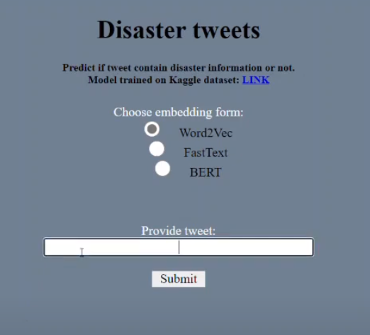

# NLP-Disaster-Tweets-with-Flask

The aim of this project was to create a webpage, where user can test different embeddings form and NLP models. 
I create 3 models and use embeddings like: word2vec, FastText and BERT. 
Models were trained on dataset from Kaggle competition. <a href="https://www.kaggle.com/c/nlp-getting-started/data">LINK</a> 
For BERT pretraining I used also 'bert-base-uncased' model. <a href="https://github.com/google-research/bert">LINK</a>
 
 
At the beginning provided text was cleaned up: digits and urls were replaced by text: DIGIT and URL.  
After that I use function simple_preprocess, which remove interpunction, convert letters to the small one etc.  
In next step this string was tokenized and convert to vector, based on previously choosen embedding.  
At the end we receive an output from catboost model.  
 
   
[[Watch the video how it works]](https://www.youtube.com/watch?v=wYNPKVg1rhE)
